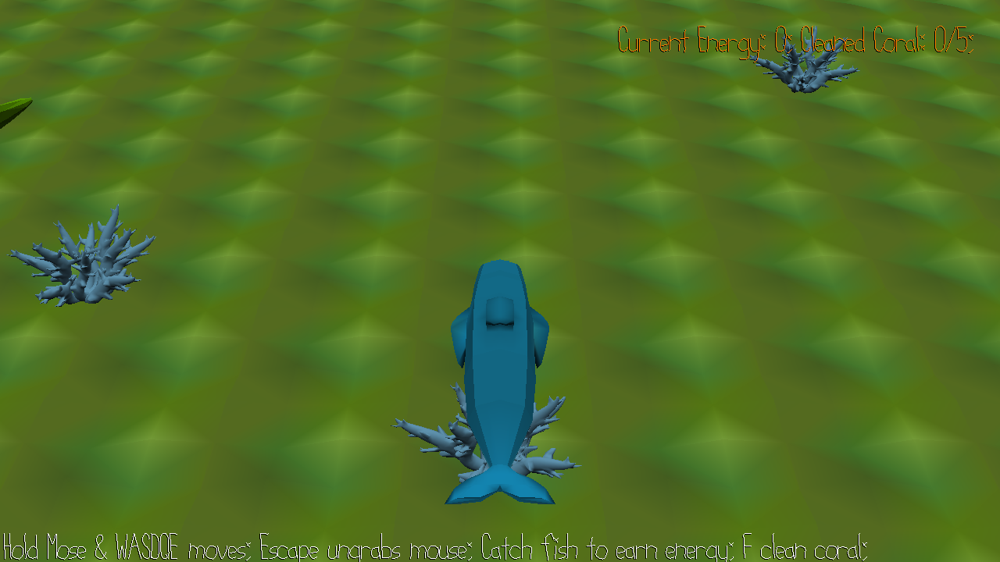

# Ocean Guardian

Author: Yue Wang

Design: You are a dolphin who catch fish to get energy and use the energy to clean the coral.

Screen Shot:

How To Play:
Goal: clean 5 corals
·Move - Hold mouse left button and press W/A/S/D/Q/E
·Catch fish - when the dolphin touch the fish, it will catch the fish automaticlly
·Clean coral - F (when the dolphin close to the coral)

This game was built with [NEST](NEST.md).
